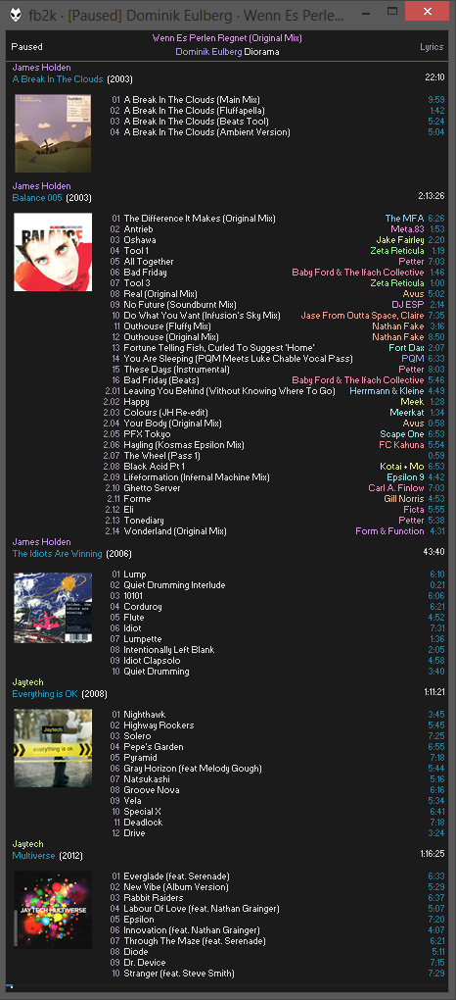

# blackbird

When I was a younger lad, I used to main foobar2000. This is what my highly-customised theme looked like:

With the "wisdom" of age, two things have happened: I have recognised that there are aspects of that theme that are suboptimal, and I now daily Linux, where fb2k will not run without Wine.

To deal with the latter, I'm using Navidrome to host my music collection, but none of the clients I've used really hit the right spot. They're not dense enough, they're not optimised for my workflow, or they're on their third rewrite.

`blackbird` is a Subsonic protocol client by me, for me. I don't expect anyone to match my kind of freak, but I open-source most of my software, so here it is. It's designed to get as close to that original theme as possible, while being at least somewhat practical to use.