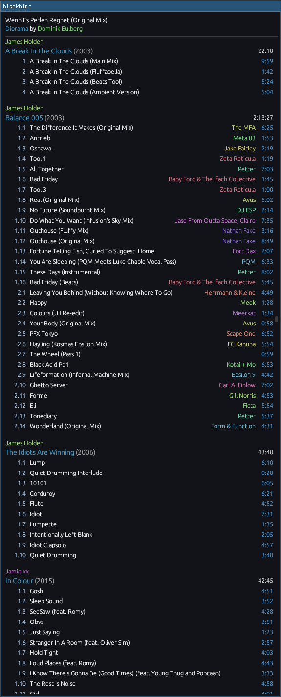

# blackbird

`blackbird` is a Subsonic protocol client by me, for me. I don't expect anyone to match my kind of freak, but I open-source most of my software, so here it is. It's designed to get as close to my original foobar2000 theme as possible, while being at least somewhat practical to use.

I would still use foobar2000, but I run Linux these days, and I don't really feel like running it under Wine. I also want my music to be streamable, so I'm using Navidrome to host my music collection.

Unfortunately, the existing Navidrome/Subsonic clients don't really hit the right spot. They're not dense enough, they're not optimised for my workflow, or they're on their third rewrite.

`blackbird` is my workaround for that.

---

When I was a younger lad, I used to main foobar2000. This is what my highly-customised theme looked like:

`blackbird` is not quite that dense, I'm afraid, but all things considered, it's probably nicer on the eyes.