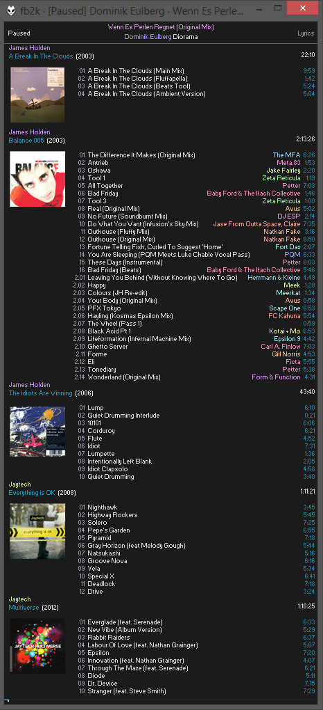

# blackbird

The current client is a terminal UI. A screenshot is pending; the retired egui GUI client was removed in favor of it.

`blackbird` is a Subsonic protocol client by me, for me. I don't expect anyone to match my kind of freak, but I open-source most of my software, so here it is. It's designed to get as close to my original foobar2000 theme as possible, while being at least somewhat practical to use.

I would still use foobar2000, but I run Linux these days, and I don't really feel like running it under Wine. I also want my music to be streamable, so I'm using Navidrome to host my music collection.

Unfortunately, the existing Navidrome/Subsonic clients don't really hit the right spot. They're not dense enough, they're not optimised for my workflow, or they're on their third rewrite.

`blackbird` is my workaround for that.

---

When I was a younger lad, I used to main foobar2000. This is what my highly-customised theme looked like:

`blackbird` is not quite that dense, I'm afraid, but all things considered, it's probably nicer on the eyes.

## File locations

`blackbird` stores its files in platform-specific directories using the [etcetera](https://crates.io/crates/etcetera) crate with the native platform strategy:

| Purpose | Linux | macOS | Windows |
|---|---|---|---|
| Config (`config.toml`) | `~/.config/blackbird/` | `~/Library/Application Support/me.philpax.blackbird/` | `%APPDATA%/philpax/blackbird/config/` |
| Cache (album art) | `~/.cache/blackbird/` | `~/Library/Caches/me.philpax.blackbird/` | `%LOCALAPPDATA%/philpax/blackbird/cache/` |
| Data (logs) | `~/.local/share/blackbird/` | `~/Library/Application Support/me.philpax.blackbird/` | `%APPDATA%/philpax/blackbird/data/` |

The client writes its log to the data directory as `blackbird.log`. Any pre-existing `blackbird-gui.log` files from the retired GUI client are orphaned by this change and can be deleted manually.

### Sidebar and similar songs

The current-track sidebar is split into ordered components configured under `[layout.sidebar]`:

- `enabled` — whether the sidebar is visible at runtime; toggle with `t` in the TUI. Which side the sidebar sits on is `position` below.
- `position` — which side the sidebar sits on (`"left"` or `"right"`, default `"right"`).
- `components` — the ordered component list, e.g. `["lyrics", "similar_songs"]` (default).
- `similar_songs_count` — how many similar songs to request (default 20).

Similar songs come from the server's OpenSubsonic surface. blackbird discovers the server's extensions via `getOpenSubsonicExtensions` at load/reload: when the server advertises `sonicSimilarity` (e.g. Navidrome with the AudioMuse-AI plugin), the sonic-similarity endpoint is used; otherwise it falls back to `getSimilarSongs2`.

---

The contributing guidelines in [CONTRIBUTING.md](./CONTRIBUTING.md) are adapted from [philpax/contributing-templates](https://github.com/philpax/contributing-templates), which in turn derives from [nextest's AGENTS.md](https://github.com/nextest-rs/nextest/blob/main/AGENTS.md).
